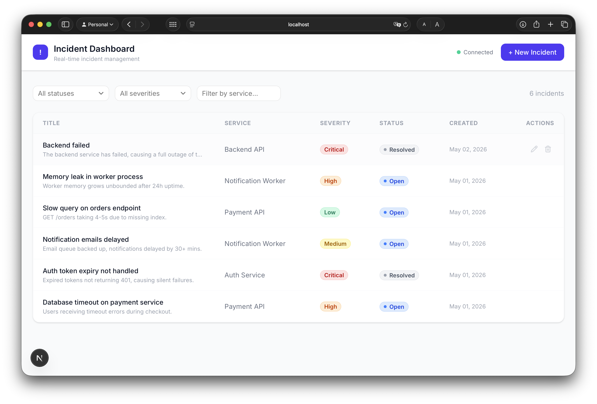
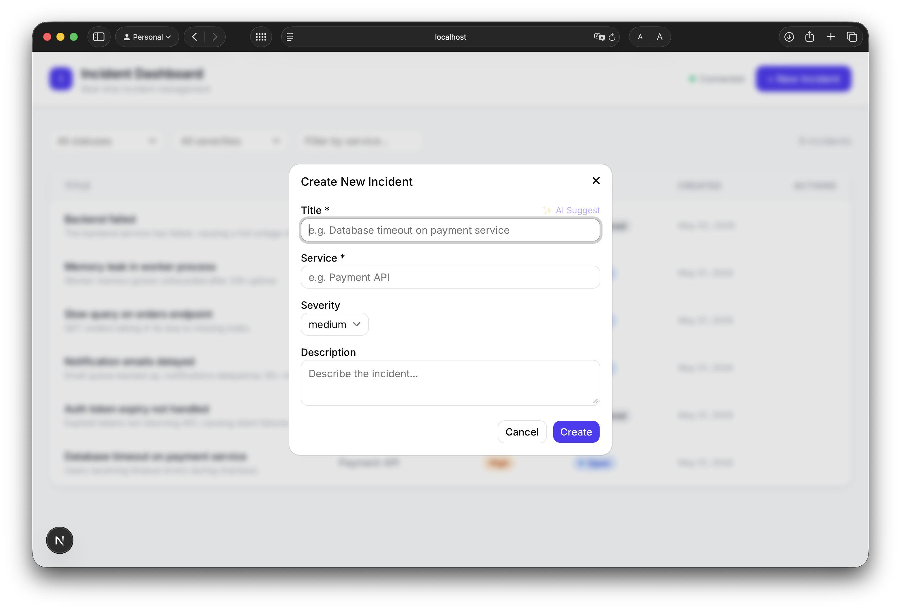
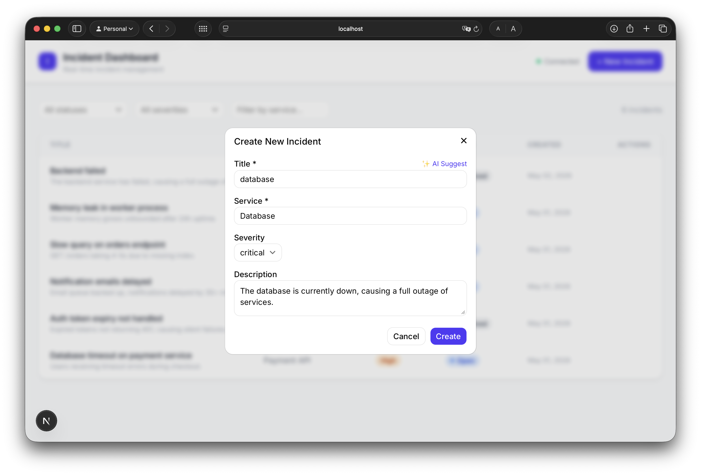
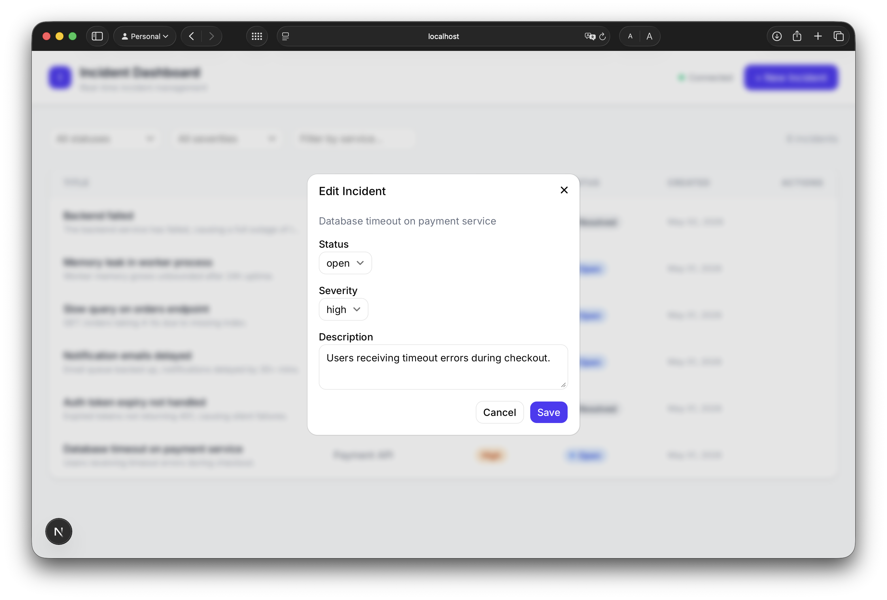
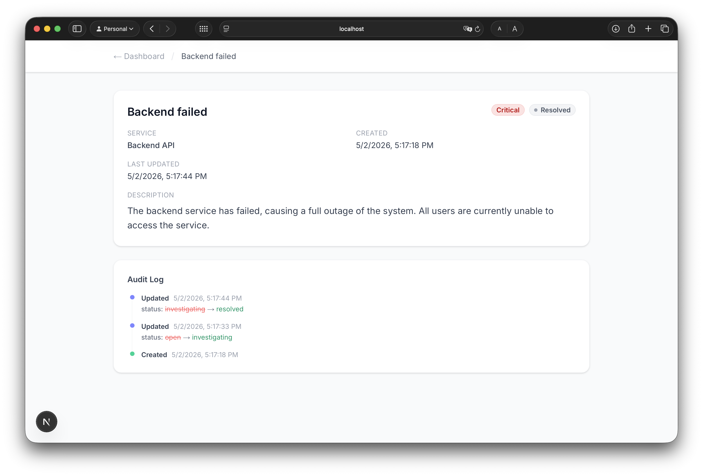
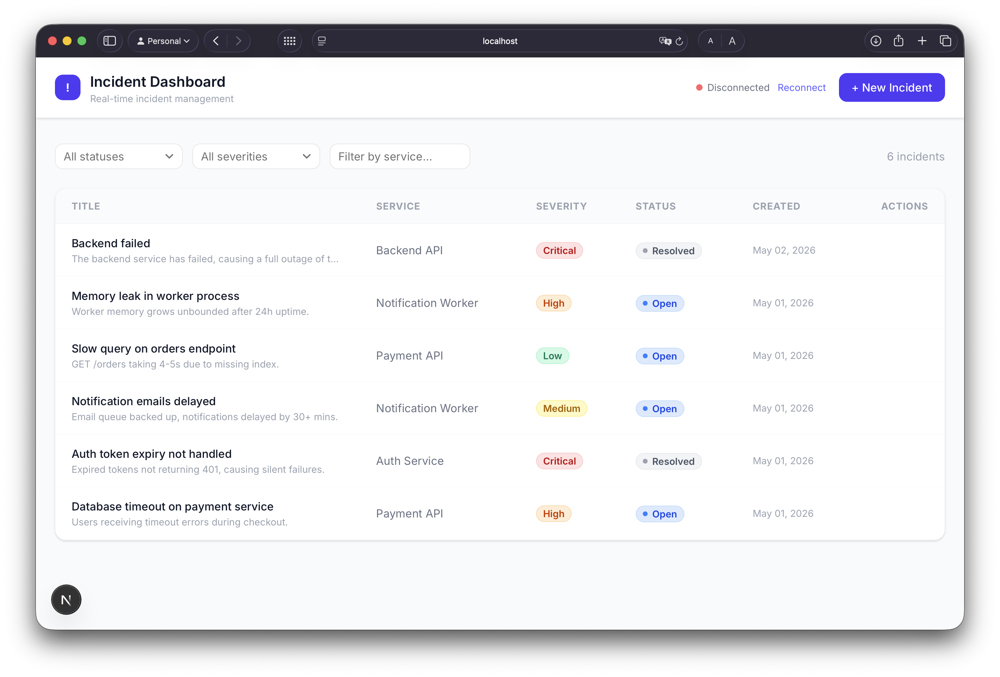

# Incident Management Dashboard

Real-time incident management dashboard. Helps software teams track service outages and critical events from a central location.

**Stack:** NestJS · Next.js 15 · PostgreSQL 16 · Socket.IO · Groq AI · Docker

---

## Screenshots

| Dashboard | Create Incident |
|-----------|----------------|
|  |  |

| AI Suggest | Edit Incident |
|------------|--------------|
|  |  |

| Incident Detail & Audit Log | Real-time Connection Status |
|-----------------------------|-----------------------------|
|  |  |

---

## Quick Start

### Requirements

- Node.js 18+
- Docker & Docker Compose

### Option A — Local Development

**1. Clone the repository**

```bash
git clone https://github.com/yyakuptelli/incident-dashboard.git
cd incident-dashboard
```

**2. Start the database**

```bash
docker compose up -d postgres
```

**3. Set up environment**

```bash
cp backend/.env.example backend/.env
```

To enable AI features, add your Groq API key ([get one free](https://console.groq.com)):

**macOS:**
```bash
sed -i '' 's/GROQ_API_KEY=/GROQ_API_KEY=your_key_here/' backend/.env
```

**Linux:**
```bash
sed -i 's/GROQ_API_KEY=/GROQ_API_KEY=your_key_here/' backend/.env
```

**Windows:** Open `backend/.env` and set `GROQ_API_KEY=your_key_here`.

**4. Backend**

```bash
cd backend
npm install
npm run start:dev
```

| URL | Description |
|-----|-------------|
| http://localhost:3001 | REST API |
| http://localhost:3001/api/docs | Swagger UI |

**5. Load sample data (optional)**

```bash
npm run seed
```

**6. Frontend**

```bash
cd ../frontend
npm install
npm run dev
```

Frontend: http://localhost:3000

---

### Option B — Full Stack with Docker

**1. Clone the repository**

```bash
git clone https://github.com/yyakuptelli/incident-dashboard.git
cd incident-dashboard
```

**2. Set up environment**

```bash
# Required for Docker Compose variable substitution
echo "GROQ_API_KEY=your_key_here" > .env
```

> `GROQ_API_KEY` is optional — omit this step to run without AI features.

**3. Start all services**

```bash
docker compose up --build
```

**4. Load sample data (optional)**

```bash
docker compose exec backend node dist/seed.js
```

Frontend: http://localhost:3000

> Without `GROQ_API_KEY` the AI feature is disabled; all other features continue to work.

---

## Environment Variables

A `backend/.env.example` file is included in the repository with all values pre-filled. Copy it and set your Groq API key:

```bash
cp backend/.env.example backend/.env
```

**macOS:**
```bash
sed -i '' 's/GROQ_API_KEY=/GROQ_API_KEY=your_key_here/' backend/.env
```

**Linux:**
```bash
sed -i 's/GROQ_API_KEY=/GROQ_API_KEY=your_key_here/' backend/.env
```

**Windows:** Open `backend/.env` in any text editor and set `GROQ_API_KEY=your_key_here`.

Replace `your_key_here` with your actual key from https://console.groq.com (free). AI features are optional — omit this step to run without them.

After adding or changing `GROQ_API_KEY`, restart the backend:

**Local:**
```bash
# Stop the running backend (Ctrl+C), then:
cd backend
npm run start:dev
```

**Docker:**
```bash
cp backend/.env backend/.env.docker
docker compose down
docker compose up --build
```

---

## Features

### Core
- Create, list, update, and delete incidents
- Severity filter, status filter, prefix-based service search
- Pagination (page / limit / total records / total pages)
- Incident detail page (`/incidents/:id`)

### Real-time
- Instant Socket.IO broadcast: new incident, update, delete
- Auto-reconnect (10 attempts, 2 s interval) + manual Reconnect button

### Quality
- Soft delete — records are never physically deleted (`@DeleteDateColumn`)
- Audit log — every create/update/delete is stored as a JSONB diff
- Optimistic UI — deletes and updates reflect immediately; rolled back on API error
- Global exception filter — all 4xx/5xx errors are logged
- 16 tests (6 unit + 10 integration)

### AI (optional)
- `POST /ai/analyze` → predicts severity, service, and summary from title + description
- Groq API, `llama-3.3-70b-versatile` model
- The "✨ AI Suggest" button in the UI auto-fills the form

#### Enabling AI Suggest

1. Go to **https://console.groq.com** and create a free account
2. Navigate to **API Keys** and click **Create API Key** — copy the key (starts with `gsk_`)
3. Copy `backend/.env.example` to `backend/.env` and paste your Groq key into the `GROQ_API_KEY` field
4. Restart the backend (`npm run start:dev` or `docker compose up --build`)
5. In the dashboard, click **+ New Incident**, type a **title** (and optionally a description), then click **✨ AI Suggest** — severity, service, and a summary will be filled in automatically

---

## API Summary

| Method | Endpoint | Description |
|--------|----------|-------------|
| `POST` | `/incidents` | Create incident |
| `GET` | `/incidents` | List — `?page&limit&status&severity&service` |
| `GET` | `/incidents/:id` | Single incident |
| `PATCH` | `/incidents/:id` | Update — status, severity, description |
| `DELETE` | `/incidents/:id` | Soft delete |
| `GET` | `/incidents/:id/audit` | Change history |
| `POST` | `/ai/analyze` | AI classification |

Full docs: http://localhost:3001/api/docs

---

## Architecture

```
backend/src/
├── incidents/
│   ├── dto/                    # Request validation with class-validator
│   ├── entities/               # TypeORM entity + soft delete
│   ├── repositories/           # Repository pattern — abstracts DB queries
│   ├── incidents.controller.ts
│   ├── incidents.service.ts
│   ├── incidents.gateway.ts    # Socket.IO WebSocket gateway
│   └── incidents.module.ts
├── audit/
│   ├── audit-log.entity.ts     # JSONB diff table
│   └── audit.service.ts
├── ai/
│   ├── ai.service.ts           # Groq API (OpenAI-compatible SDK)
│   └── ai.controller.ts
├── common/
│   └── all-exceptions.filter.ts  # Global 4xx/5xx handler
└── app.module.ts

frontend/src/
├── app/
│   ├── page.tsx                # Dashboard
│   └── incidents/[id]/page.tsx # Detail + audit log
├── components/
│   ├── IncidentTable.tsx       # Table, icon buttons, group-hover
│   ├── CreateIncidentModal.tsx # Form + AI Suggest
│   ├── UpdateStatusModal.tsx   # Update status/severity/description
│   ├── FilterBar.tsx           # Debounced service filter
│   ├── SeverityBadge.tsx
│   └── StatusBadge.tsx
├── hooks/useIncidents.ts       # Fetch + Socket.IO listeners
└── lib/
    ├── api.ts                  # HTTP client
    └── socket.ts               # Socket.IO singleton
```

**Key decisions:**

- **Repository Pattern** — Controller → Service → Repository chain; enables test isolation and shields against DB changes
- **Soft Delete** — TypeORM automatically adds `WHERE deletedAt IS NULL` via `@DeleteDateColumn()`; no data is ever lost
- **Audit Log** — A before/after diff is computed on every update; only changed fields are written as JSONB
- **Optimistic UI** — Users get immediate feedback; state is restored to its original value on API error
- **Socket State Merge** — Incoming socket events update state directly instead of triggering a `refetch()`; avoids unnecessary API requests
- **Service Filter Prefix Match** — `ILIKE 'n%'` means "n" returns only "Notification Worker"; prefix search gives more predictable results than substring search
- **Debounce** — The service filter input is debounced by 400 ms, reducing unnecessary API requests

---

## Assumptions

- Authentication / Authorization was out of scope
- The `service` field is free text (not an enum) — in a real environment the service list grows dynamically
- `synchronize: true` is used — production deployments should use TypeORM migration files instead
- CORS is open to all origins (`origin: '*'`) — should be restricted in production

---

## Given More Time

- **Authentication** — JWT + refresh token; add user identity to audit log
- **TypeORM Migrations** — Version-controlled migrations instead of `synchronize: true`
- **Rate Limiting** — API protection with `@nestjs/throttler`
- **Metrics** — Prometheus endpoint + Grafana dashboard
- **E2E Tests** — Full end-to-end tests with Supertest against a real database
- **Service Autocomplete** — Dropdown that suggests existing service names in the filter input
